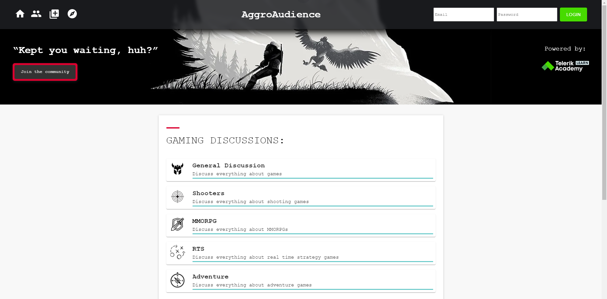

# Team 3 - React-Forum

## Welcome to our first React Project in the Academy.

### 1. We are Team 3, and we are pleased to present you our React - forum project.

The application focus lays on the gaming industry, which means that our users can write, read and discuss a wide variety of topics.

In our forum you can find all the information you need when it comes to the world of gaming.

For the build we used **React JS**, **CSS**, and some external libraries such as **Material UI**.

There are lots of interesting functionalities and some features, which make our project unique.

### 2. Project information

- Language and version: **JavaScript ES2020**, **React v18.1.0**.
- Database: **Firebase**.

# AggroAudience

---

Our project has **public** and **private (user)** part.

The public is accessible for all viewers despite being registered or not.

The private part provides the same as well as all user functionalities, which you do not have when not registered.

